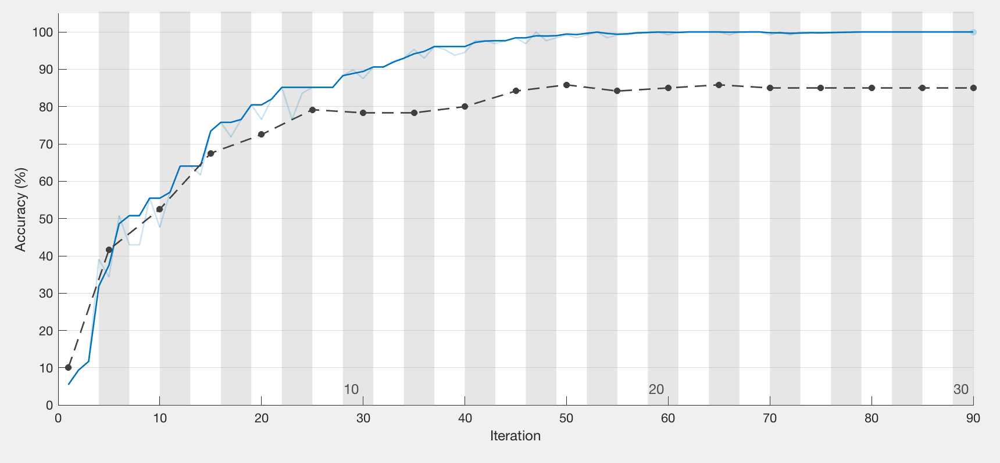
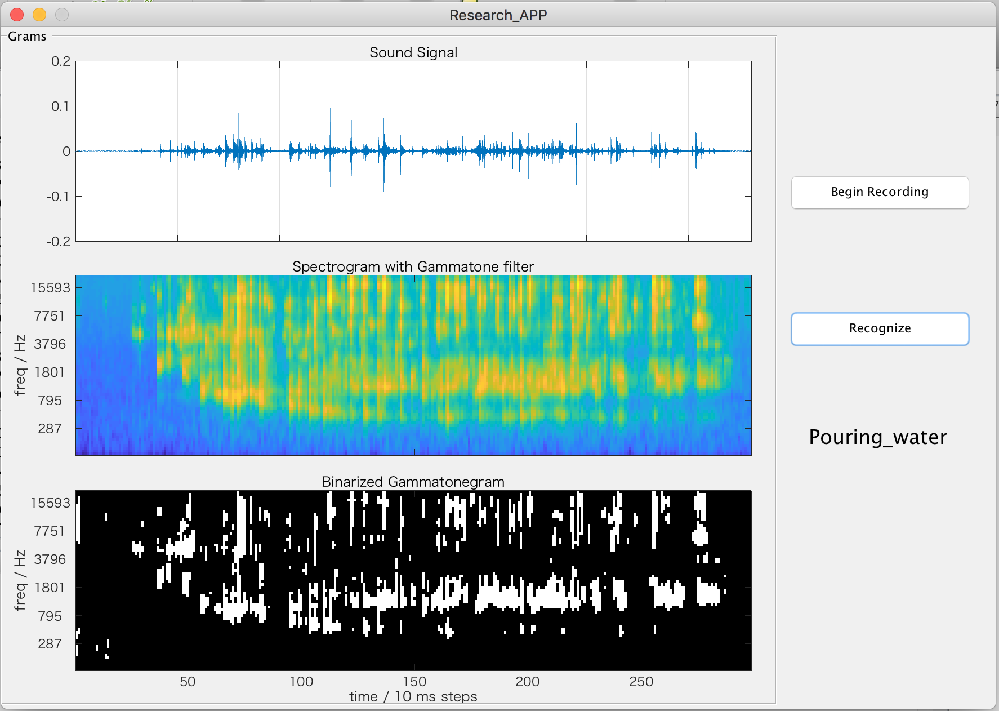

# Contents #

## Intrduction

* The purpose of this demo is to clarify the **capbility of distinguishing** environmental sounds **only with image features.**

* This was been used as the research demostration for **Open Campus** and **laboratory introduction.**

## Usage 

* This is an Matlab window application source code folder  

* You can run this application with `Research_APP.fig` importing to your Matlab with `Neural Network Toolbox `installed.

* The sound samples are in the `../NN_usage/sound_data`

* `color_net.mat` is the pre-trained CNN network using those sound data and the code in the `../NN_usage`

## Results

* In the training process, **15 kinds of sounds** and **40 samples** in each category were trained for the Neural Network. 

>
Clapping
>
Clock_alarm
>
Crackling_fire
>
Door_knock
>
Engine
>
Footsteps
>
Helicopter
>
Keyboard_typing
>
Pouring_water
>
Rain
>
Siren
>
Snoring
>
Thunderstorm
>
Water_drops
>
Wind

* The training process is as following:

* The wiew of application is as following:

* Push **`Begin Recording`** button to use the computer's microphone to record some kinds of environmental sounds.

* After that we can see the **signal wave gram** in the first row, the **spectrogram with gammatone filter** in the second row and **binarized spectrogram** in the third row.

* Push the **`Recognize`** button to classify the sound you  recorded earlier and the result will be shown under the button.
